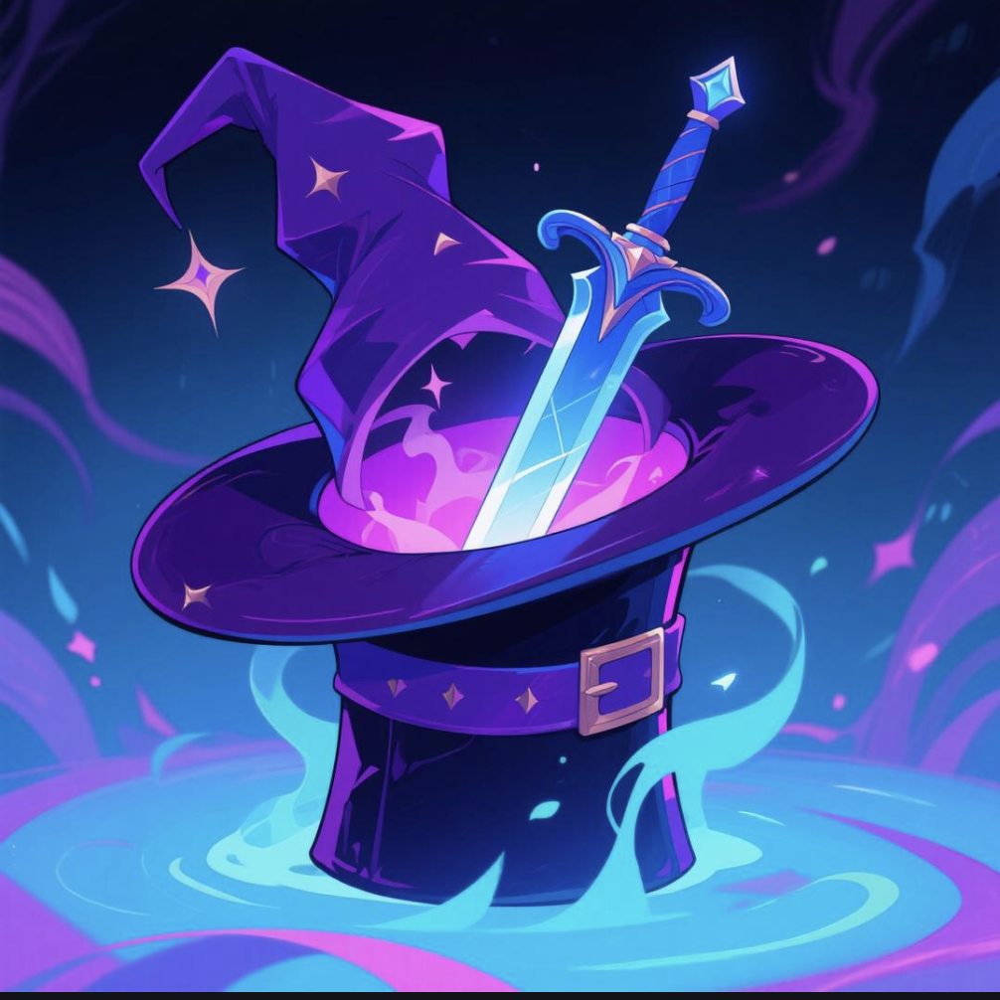

# Sword and Sorcery

<p align="center">
  
</p>

<p align="center">
  <a href="https://swordsorcery.online" target="_blank">Website</a> •
  <a href="https://x.com/SorceryAndSword" target="_blank">Twitter</a> •
  <a href="Sword%20and%20Sorcery%20Whitepaper.MD" target="_blank">Whitepaper</a>
</p>

## Overview

Sword and Sorcery is a transformative WEB3 multiplayer sword-fighting game built on the Solana blockchain. It delivers a fast-paced, equitable, and immersive competitive experience by blending classic arcade-style sword combat with blockchain-enabled asset ownership and decentralized governance. Players earn $SNS tokens through skillful duels, community tournaments, and interactive in-game engagements.

## Core Features

- **Real-time Combat**: Fast-paced multiplayer sword fighting with strategic depth
- **Blockchain Integration**: Solana-powered $SNS tokens and NFT rewards
- **Multiple Game Modes**: Deathmatch, Team Duel, and Conquest
- **Character Archetypes**: Knight, Rogue, Sorcerer, and Berserker
- **Generative NFT System**: Unique sword skins with visual effects
- **DAO Governance**: Community-driven game updates and tournaments

## Game Architecture

### Layered Technical Structure

Sword and Sorcery is built on a three-tier architecture:

1. **Frontend Layer**
   - Phaser.js 3.55.2 for WebGL-accelerated 2D rendering
   - React 18 with TailwindCSS for responsive UI
   - Redux for state management
   - Socket.io client for real-time communication

2. **Backend Layer**
   - Node.js with Express for RESTful APIs
   - Socket.io for real-time multiplayer (RTMP)
   - MongoDB for player profiles and match history
   - Redis for caching leaderboards and matchmaking queues

3. **Blockchain Layer**
   - Solana for NFT assets and $SNS token transactions
   - Smart contracts for reward distribution and DAO governance
   - IPFS/Arweave for decentralized storage

### Game Execution Flow

1. **Authentication**: Players connect their Solana wallet (Phantom, Solflare, etc.)
2. **Matchmaking**: Reinforcement Learning algorithms match players based on skill level
3. **Game Session**: Real-time multiplayer combat with Server-Side Validation
4. **Reward Distribution**: Smart contracts automatically distribute $SNS based on performance
5. **NFT Integration**: Players can earn and use NFT sword skins across matches

## Installation and Setup

### Prerequisites

- Node.js v16+
- MongoDB
- Solana CLI tools
- A Solana wallet (Phantom, Solflare, etc.)

### Development Environment

1. Clone the repository:
```bash
git clone https://github.com/SwordSorcery/SwordNSorcery.git
cd SwordNSorcery
```

2. Install dependencies:
```bash
npm run install:all
```

3. Configure environment variables:
```bash
# Copy sample environment variables
cp server/.env.sample server/.env
# Edit with your configuration
```

4. Start development servers:
```bash
# Start both client and server in development mode
npm run dev
```

### Docker Setup

For containerized deployment:
```bash
docker-compose up
```

## Game Mechanics

### Combat System

- **Movement**: WASD/arrow keys for character control
- **Attacks**: Light attacks (fast, low damage) and heavy attacks (slow, high damage)
- **Defense**: Blocks negate damage, dodges evade attacks
- **Stamina**: Resource management for attacks and defensive actions
- **Combos**: Chain attacks for bonus damage and effects

### Game Modes

- **Deathmatch**: 4-8 players compete for kills (10-minute rounds)
- **Team Duel**: 4v4 team-based combat with objectives (12-minute rounds)
- **Conquest**: Capture and hold arena points (15-minute rounds)

### Warrior Archetypes

- **Knight**: High defense, low speed, suited for tanking
- **Rogue**: High speed, low defense, ideal for hit-and-run tactics
- **Sorcerer**: Balanced stats with magic-enhanced attacks
- **Berserker**: High damage, low survivability, for aggressive play

## Economic Model

### $SNS Token Utility

- In-game rewards for skill-based gameplay
- Purchasing and trading NFT sword skins
- DAO governance voting rights
- Community incentives for curation and participation

### Reward Mechanisms

- **Match Performance**: Earn tokens for kills, assists, and objectives
- **Tournaments**: Compete in weekly and monthly events for bonus rewards
- **Achievements**: Complete milestones for on-chain badges and tokens
- **Seasons**: Earn rank-based rewards at the end of each season

## Contributing

We welcome contributions from the community! Please refer to our [Contributing Guide](CONTRIBUTING.md) for details on how to get involved.

## License

[MIT](LICENSE)

---

<p align="center">
  "Wield $SNS, Forge Your Legend"
</p> 
